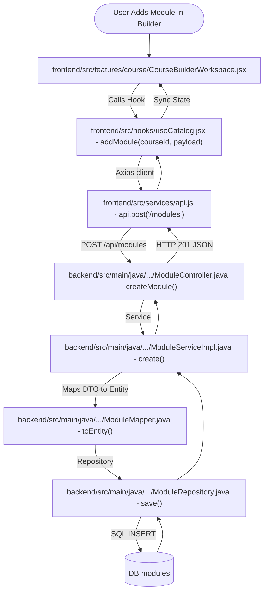
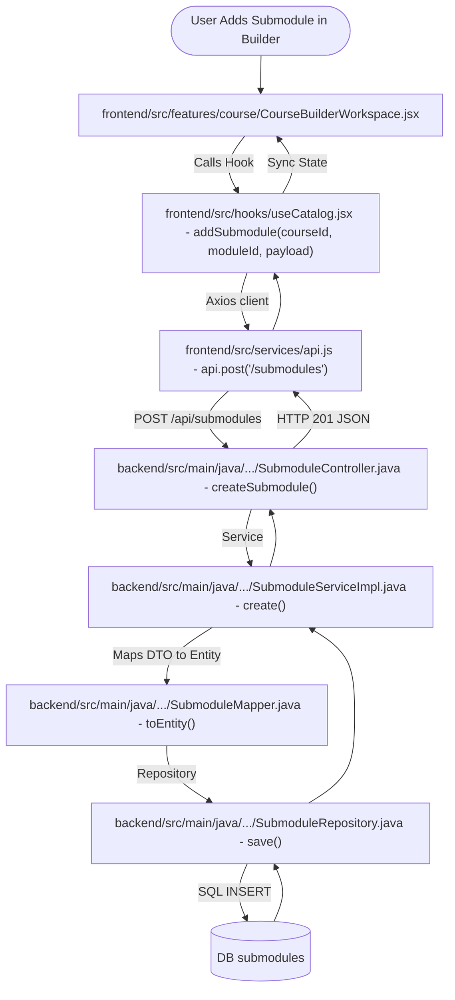
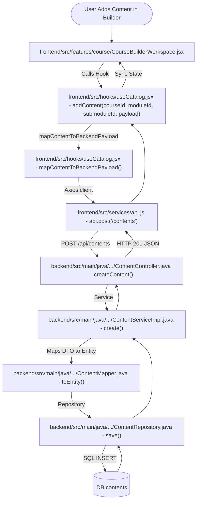
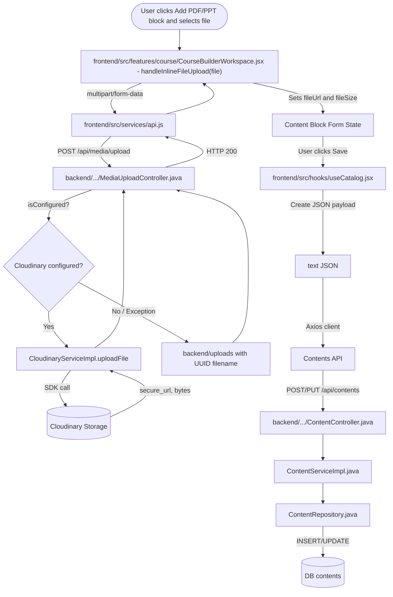
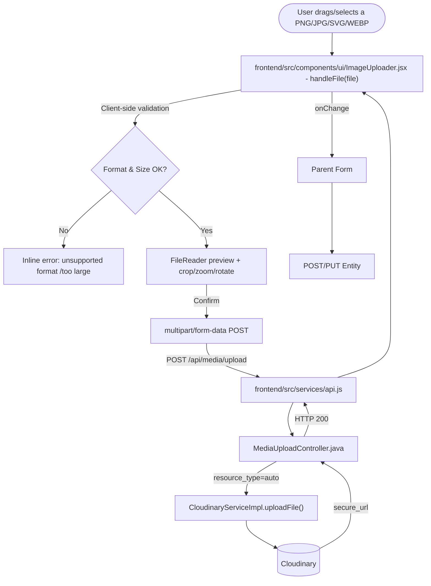

# Curriculum Modules Flow & Reference Documentation

This document outlines the data fields, the end-to-end frontend-to-backend request flows, and the media storage architecture for the **Modules, Submodules, and Contents** (Curriculum) components in Xebia LMS.

The Curriculum module is the innermost building block of the platform's content hierarchy:

```
Category ➔ Course ➔ Module ➔ Submodule ➔ Content Block
```

Each **Content Block** inside a Submodule can be one of 9 types — `heading`, `text`, `callout`, `code`, `video`, `pdf`, `ppt`, `image`, and `table` — and PDF/PPT/PNG (image) blocks are the ones backed by real file uploads stored on **Cloudinary**.

---

## 1. Data Models & Entity Fields

### 1.1 Modules
*   **Database Table:** `modules`
*   **Entity File:** backend/src/main/java/com/geeknito/LMS_backend/entity/learning/ModuleEntity.java
*   **Request DTO:** backend/src/main/java/com/geeknito/LMS_backend/dto/ModuleRequestDTO.java
*   **Response DTO:** backend/src/main/java/com/geeknito/LMS_backend/dto/ModuleResponseDTO.java

#### Core Fields
1.  `id` (`Long`, Primary Key, Generated Identity)
2.  `title` (`String`, `NOT NULL`, max 200)
3.  `description` (`String`, TEXT)
4.  `moduleOrder` (`Integer`, sorting order index, default `0`)
5.  `isActive` (`Boolean`, default `true`)
6.  `logo` / `banner` / `backgroundImage` / `thumbnail` (`String`, max 1000 — Cloudinary image URLs)
7.  `createdAt` / `updatedAt` (`LocalDateTime`, auto-managed timestamps)
8.  `course` (`ManyToOne` → `CourseEntity`, `course_id` Foreign Key)
9.  `submodules` (`OneToMany` → `SubmoduleEntity`, cascade `ALL`)

---

### 1.2 Submodules
*   **Database Table:** `submodules`
*   **Entity File:** backend/src/main/java/com/geeknito/LMS_backend/entity/learning/SubmoduleEntity.java
*   **Request DTO:** backend/src/main/java/com/geeknito/LMS_backend/dto/SubmoduleRequestDTO.java
*   **Response DTO:** backend/src/main/java/com/geeknito/LMS_backend/dto/SubmoduleResponseDTO.java

#### Core Fields
1.  `id` (`Long`, Primary Key, Generated Identity)
2.  `title` (`String`, `NOT NULL`, max 200)
3.  `description` (`String`, TEXT)
4.  `slug` (`String`, `NOT NULL`, `UNIQUE`, max 250)
5.  `submoduleOrder` (`Integer`, sorting order index, default `0`)
6.  `isActive` (`Boolean`, default `true`)
7.  `logo` / `banner` / `backgroundImage` / `thumbnail` (`String`, max 1000 — Cloudinary image URLs)
8.  **SEO Fields:** `metaTitle` (max 70), `metaDescription` (max 320), `canonicalUrl` (max 1000), `ogTitle` (max 150), `ogDescription` (max 500), `ogImage` (max 1000)
9.  `createdAt` / `updatedAt` (`LocalDateTime`, auto-managed timestamps)
10. `module` (`ManyToOne` → `ModuleEntity`, `module_id` Foreign Key)
11. `contents` (`OneToMany` → `ContentEntity`, cascade `ALL`)

---

### 1.3 Contents

*   **Database Table:** `contents`
*   **Entity File:** backend/src/main/java/com/geeknito/LMS_backend/entity/learning/ContentEntity.java
*   **Request DTO:** backend/src/main/java/com/geeknito/LMS_backend/dto/ContentRequestDTO.java
*   **Response DTO:** backend/src/main/java/com/geeknito/LMS_backend/dto/ContentResponseDTO.java

#### Persisted Core Fields (actual `contents` table columns)
1.  `id` (`Long`, Primary Key, Generated Identity)
2.  `title` (`String`, max 300)
3.  `type` (`String`, `NOT NULL`, max 30 — one of: `heading`, `text`, `callout`, `code`, `video`, `pdf`, `ppt`, `image`, `table`)
4.  `text` (`String`, TEXT) — for `text` / `notes` / `heading` / `callout` / `table` blocks this holds the raw editor content; for **file-backed blocks (`pdf`, `ppt`, `video`, `image`)** it holds a **JSON-encoded metadata payload** (see §3.6)
5.  `code` (`String`, TEXT)
6.  `language` (`String`, max 50)
7.  `videoUrl` (`String`, max 500 — populated only when `type = video`)
8.  `imageUrl` (`String`, max 500 — populated when `type = image`, and also reused as the "thumbnail URL" field for other block types)
9.  `alt` (`String`, max 200)
10. `caption` (`String`, max 300)
11. `headingLevel` (`Integer`)
12. `contentOrder` (`Integer`, sorting order index, default `0`)
13. `isActive` (`Boolean`, default `true`)
14. `createdAt` / `updatedAt` (`LocalDateTime`, auto-managed timestamps)
15. `submodule` (`ManyToOne` → `SubmoduleEntity`, `submodule_id` Foreign Key, `NOT NULL`)

> ⚠️ **Correction from the earlier version of this document:** `ContentEntity` does **not** have dedicated `fileUrl`, `fileSize`, `pageCount`, `slideCount`, or `duration` columns. There is no schema-level table for uploaded files. Instead, the frontend packs these fields into a JSON object and stores it in the shared `text` column — see §3.6 for the exact shape and rationale.

#### Frontend-Only Virtual Fields (derived, not real columns)
These fields exist only inside the React app's content object (`frontend/src/hooks/useCatalog.jsx` → `mapBackendContent()`) and are reconstructed on every fetch by parsing the JSON stored in `text`:
*   `fileUrl` (`String`) — Cloudinary `secure_url` of the uploaded PDF/PPT/video/image asset
*   `fileSize` (`Number`, bytes)
*   `pageCount` (`Number`) — used only for `type = pdf`
*   `slideCount` (`Number`) — used only for `type = ppt`
*   `duration` (`String`) — used only for `type = video`

---

## 2. End-to-End Flows (Frontend to Backend)

### 2.1 Flow 1: Adding a Module in Course Builder



#### Step-by-Step Execution Sequence
1.  **Frontend trigger:** Within frontend/src/features/course/CourseBuilderWorkspace.jsx, the user clicks "Add Module", enters a title, and confirms.
2.  **State Hook:** frontend/src/hooks/useCatalog.jsx triggers `addModule(courseId, payload)`, computing `moduleOrder` index dynamically.
3.  **Axios API layer:** frontend/src/services/api.js sends JSON body to `POST /api/modules`.
4.  **REST Controller:** backend/src/main/java/com/geeknito/LMS_backend/controller/ModuleController.java binds the parameter attributes to `ModuleRequestDTO`.
5.  **Service Impl:** backend/src/main/java/com/geeknito/LMS_backend/serviceImpl/ModuleServiceImpl.java transforms the mapping using backend/src/main/java/com/geeknito/LMS_backend/mapper/ModuleMapper.java.
6.  **Repository save:** backend/src/main/java/com/geeknito/LMS_backend/repository/ModuleRepository.java commits records to the `modules` database table.

---

### 2.2 Flow 2: Adding a Submodule in Course Builder



#### Step-by-Step Execution Sequence
1.  **Frontend trigger:** In the course building panel (frontend/src/features/course/CourseBuilderWorkspace.jsx), the user clicks "Add Submodule" inside a module card.
2.  **State Hook:** frontend/src/hooks/useCatalog.jsx calls `addSubmodule(courseId, moduleId, payload)`.
3.  **Axios API layer:** frontend/src/services/api.js dispatches data payload to `POST /api/submodules`.
4.  **REST Controller:** backend/src/main/java/com/geeknito/LMS_backend/controller/SubmoduleController.java receives request parameters in `createSubmodule()`.
5.  **Service Impl:** backend/src/main/java/com/geeknito/LMS_backend/serviceImpl/SubmoduleServiceImpl.java maps inputs using backend/src/main/java/com/geeknito/LMS_backend/mapper/SubmoduleMapper.java and saves.
6.  **Repository save:** backend/src/main/java/com/geeknito/LMS_backend/repository/SubmoduleRepository.java saves submodule details.

---

### 2.3 Flow 3: Creating Content under a Submodule (Text / Code / Heading / Callout / Table)



#### Step-by-Step Execution Sequence
1.  **Frontend trigger:** Inside a submodule's dropdown builder, the user chooses a content type (heading, text, callout, code, table) and clicks "Add Content Item".
2.  **State Hook:** frontend/src/hooks/useCatalog.jsx calls `addContent(courseId, moduleId, submoduleId, payload)`.
3.  **Payload shaping:** `mapContentToBackendPayload()` writes the editor value straight into `text` for these block types (no JSON packing is needed since there is no attached file).
4.  **Axios API layer:** frontend/src/services/api.js dispatches the details to `POST /api/contents`.
5.  **REST Controller:** backend/src/main/java/com/geeknito/LMS_backend/controller/ContentController.java parses request into `ContentRequestDTO`.
6.  **Service Impl:** backend/src/main/java/com/geeknito/LMS_backend/serviceImpl/ContentServiceImpl.java converts DTO to Entity using backend/src/main/java/com/geeknito/LMS_backend/mapper/ContentMapper.java and runs the transaction.
7.  **Repository save:** backend/src/main/java/com/geeknito/LMS_backend/repository/ContentRepository.java inserts content attributes into the table.

For **PDF, PPT, Video, and Image** content blocks, the same endpoint and flow above is used to persist the content record, but it is always preceded by a **separate file upload call** to Cloudinary — documented in full in Section 3 below.

---

## 3. Media Storage Architecture — Cloudinary Integration (PDF, PPT & PNG/Image Handling)

The Curriculum Builder's file-backed content blocks (`pdf`, `ppt`, `image`, and `video`) are **not stored as binary blobs in PostgreSQL**. Instead, the raw file is uploaded to **Cloudinary** first, and only the returned secure URL (plus lightweight metadata like size/page count/slide count) is persisted alongside the content record.

### 3.1 Backend Components

| Component | File | Responsibility |
| --- | --- | --- |
| `CloudinaryService` (interface) | backend/src/main/java/com/geeknito/LMS_backend/service/CloudinaryService.java | Defines `uploadFile(MultipartFile)` and `isConfigured()` |
| `CloudinaryServiceImpl` | backend/src/main/java/com/geeknito/LMS_backend/serviceImpl/CloudinaryServiceImpl.java | Initializes the Cloudinary SDK client (`com.cloudinary:cloudinary-http44:1.36.0`) from `@Value` injected credentials and performs the actual upload |
| `MediaUploadController` | backend/src/main/java/com/geeknito/LMS_backend/controller/MediaUploadController.java | Exposes `POST /api/media/upload`, orchestrates the Cloudinary-first / local-disk-fallback logic, and normalizes the response |
| `LMSBackendApplication` | backend/src/main/java/com/geeknito/LMS_backend/LMSBackendApplication.java | Boot-time `.env` loader that copies `CLOUDINARY_CLOUD_NAME`, `CLOUDINARY_API_KEY`, `CLOUDINARY_API_SECRET` into JVM system properties so `@Value("${cloudinary.cloud-name}")` etc. resolve correctly |

### 3.2 Configuration

*   **Environment variables** (`backend/.env`): `CLOUDINARY_CLOUD_NAME`, `CLOUDINARY_API_KEY`, `CLOUDINARY_API_SECRET`
*   **application.properties:**
    ```properties
    cloudinary.cloud-name=${cloudinary.cloud-name:${CLOUDINARY_CLOUD_NAME:}}
    cloudinary.api-key=${cloudinary.api-key:${CLOUDINARY_API_KEY:}}
    cloudinary.api-secret=${cloudinary.api-secret:${CLOUDINARY_API_SECRET:}}

    spring.servlet.multipart.max-file-size=50MB
    spring.servlet.multipart.max-request-size=50MB
    ```
*   `CloudinaryServiceImpl.init()` (a `@PostConstruct` hook) checks all three credentials are non-blank before building the `Cloudinary` client with `secure=true`. If any credential is missing, `configured` stays `false` and every upload silently falls back to local disk storage — **the app never hard-fails just because Cloudinary isn't configured.**

### 3.3 Upload Strategy — `resource_type: auto`

`CloudinaryServiceImpl.uploadFile()` always calls the Cloudinary uploader with `resource_type = "auto"`. Cloudinary inspects the incoming bytes and mime type and buckets the asset itself:

| Content Type | File extensions | Cloudinary `resource_type` used |
| --- | --- | --- |
| **Image** | `.png`, `.jpg`, `.jpeg`, `.svg`, `.webp` | `image` |
| **Video** | `.mp4`, `.webm`, `.mov` | `video` |
| **PDF** | `.pdf` | `raw` (auto-detected) |
| **PPT / PPTX** | `.ppt`, `.pptx` | `raw` (auto-detected) |

This is why a single `CloudinaryService.uploadFile()` method and a single `/api/media/upload` endpoint can serve every file-backed block type in the Curriculum Builder — there is no branching per file type on the backend.

### 3.4 `POST /api/media/upload` — Request/Response Contract

*   **Request:** `multipart/form-data` with a single `file` field.
*   **Success response (Cloudinary path):**
    ```json
    {
      "message": "Upload successful (Cloudinary)",
      "data": {
        "url": "<cloudinary secure_url>",
        "name": "<original filename>",
        "size": 5420000
      }
    }
    ```
*   **Fallback response (local disk path, used only when Cloudinary is unconfigured or the upload call throws):**
    ```json
    {
      "message": "Upload successful (Local Fallback)",
      "data": {
        "url": "/uploads/<uuid>.<ext>",
        "name": "<original filename>",
        "size": 5420000
      }
    }
    ```
*   Files that fall back to disk are written into the `backend/uploads/` directory (created on demand) under a random UUID filename to avoid collisions.

### 3.5 Frontend Upload Entry Points

All three entry points below call the exact same `POST /media/upload` endpoint via `frontend/src/services/api.js`:

| Component | Used for | Notes |
| --- | --- | --- |
| frontend/src/components/ui/ImageUploader.jsx | PNG/JPG/SVG/WEBP images — Category logos/banners, Course/Module/Submodule thumbnails, and `image` content blocks | Client-side validates `allowedFormats` (`image/jpeg`, `image/jpg`, `image/png`, `image/svg+xml`, `image/webp`) and a configurable `maxSizeMB` (default 5MB) before upload; includes crop/zoom/rotate preview UI |
| frontend/src/features/course/CourseBuilderWorkspace.jsx | Inline "Click to upload PDF/PPT file" drag-and-drop zone inside the Content Block editor (`handleInlineFileUpload()`) | Accepts `.pdf` or `.ppt,.pptx` based on the selected block type; tracks `contentUploadProgress` via Axios `onUploadProgress` |
| frontend/src/pages/UploadContentPage.jsx | Standalone bulk "Upload Content" page (`handleFileUpload()`) | Validates extension/mime per selected `type` (pdf, ppt/pptx, doc/docx, video, audio, zip, image) and enforces a **50MB** hard limit before calling the API |

### 3.6 Flow: Uploading a PDF or PPT Content Block



#### Step-by-Step Execution Sequence
1.  **File selection:** Inside the PDF/PPT block editor in frontend/src/features/course/CourseBuilderWorkspace.jsx, the user either drags a file into the drop zone or clicks "Click to upload PDF/PPT file", and separately types in a `Page Count` / `Slide Count` value.
2.  **Upload call:** `handleInlineFileUpload(file)` wraps the file in a `FormData` object and issues `api.post('/media/upload', formData)`, tracking progress via `onUploadProgress`.
3.  **Backend routing:** backend/src/main/java/com/geeknito/LMS_backend/controller/MediaUploadController.java checks `CloudinaryService.isConfigured()`.
4.  **Cloudinary upload:** If configured, backend/src/main/java/com/geeknito/LMS_backend/serviceImpl/CloudinaryServiceImpl.java uploads the raw bytes with `resource_type=auto`; Cloudinary auto-classifies PDFs/PPTs as `raw` assets and returns a `secure_url` plus `bytes` (file size).
5.  **Fallback:** If Cloudinary is not configured, or the SDK call throws, the controller writes the file to `backend/uploads/<uuid>.<ext>` and returns a relative `/uploads/...` URL instead.
6.  **Form state update:** The returned `{ url, name, size }` populates `contentForm.fileUrl` and `contentForm.fileSize` in the React form — this is not yet saved to the database.
7.  **Content save:** When the user clicks "Save", `addContent()`/`updateContent()` in frontend/src/hooks/useCatalog.jsx calls `mapContentToBackendPayload()`, which — because `pdf`/`ppt` are **not** in the plain-text type list (`text`, `notes`, `code`, `heading`, `callout`, `table`) — serializes `{ fileSize, fileUrl, duration, pageCount, slideCount }` into a JSON string and assigns it to the outgoing `text` field.
8.  **Persistence:** `POST /api/contents` (or `PUT /api/contents/{id}`) is sent with `type: "pdf"` (or `"ppt"`) and this JSON string as `text`. backend/src/main/java/com/geeknito/LMS_backend/controller/ContentController.java → `ContentServiceImpl.java` → `ContentRepository.java` persist the row, storing the JSON blob directly in the `text` column.
9.  **Read-back:** On the next fetch, frontend/src/hooks/useCatalog.jsx → `mapBackendContent()` detects the type is not a plain-text type, `JSON.parse()`s `ct.text`, and rehydrates `fileUrl`, `fileSize`, `pageCount`, and `slideCount` back onto the content object for the UI.
10. **Rendering:** frontend/src/components/builder/ContentPreviewDrawer.jsx reads `content.pageCount` / `content.slideCount` to render "`N pages`" or "`N slides`" badges, and links out to `content.fileUrl` (the Cloudinary `secure_url`) for viewing/downloading the actual PDF/PPTX file.

### 3.7 Flow: Uploading a PNG/Image (Thumbnails, Logos, Banners & Image Blocks)



#### Step-by-Step Execution Sequence
1.  **File selection:** The user drags/drops or browses a file into frontend/src/components/ui/ImageUploader.jsx, used across Category logos/banners, Course/Module/Submodule thumbnails, and `image` type content blocks.
2.  **Client-side validation:** `validateFile()` checks the MIME type against `allowedFormats` (`image/jpeg`, `image/jpg`, `image/png`, `image/svg+xml`, `image/webp`) and the file size against `maxSizeMB` (default 5MB, configurable per usage).
3.  **Local preview:** A `FileReader` generates a base64 data URL so the user can preview, zoom, rotate, and crop before confirming the upload — no network call happens yet.
4.  **Upload call:** On confirm, the component posts the file as `multipart/form-data` to `POST /api/media/upload`, identical to the PDF/PPT flow.
5.  **Cloudinary classification:** Because the payload's mime type is `image/*`, Cloudinary's `resource_type=auto` detection stores it as an `image` asset (as opposed to `raw` for PDF/PPT), enabling Cloudinary's built-in image transformations/CDN delivery.
6.  **Parent form update:** The returned `secure_url` is passed back via the `onChange(url)` callback to whichever parent form is using the uploader — e.g. `logo`/`banner`/`backgroundImage`/`thumbnail` fields on Category, Course, Module, or Submodule forms, or `imageUrl` on an `image` type Content Block.
7.  **Persistence:** The parent form's normal save action (`createCategory`/`updateCategory`, `createCourse`/`updateCourse`, `addModule`, `addSubmodule`, or `addContent`/`updateContent` in frontend/src/hooks/useCatalog.jsx) sends this URL string as a plain field in its DTO payload — unlike PDF/PPT, image URLs for `image` type blocks are written directly to the real `imageUrl` column, not packed into the `text` JSON blob.

### 3.8 Summary: Why PDF/PPT Differ From Image/Video Persistence

| Block Type | Cloudinary `resource_type` | Where the URL is persisted |
| --- | --- | --- |
| `image` | `image` | Real column: `contents.image_url` |
| `video` | `video` | Real column: `contents.video_url` |
| `pdf` | `raw` | JSON-packed inside `contents.text` (`fileUrl`, `fileSize`, `pageCount`) |
| `ppt` | `raw` (also handles `.pptx`) | JSON-packed inside `contents.text` (`fileUrl`, `fileSize`, `slideCount`) |

This asymmetry exists because `ContentEntity` was only ever given dedicated `videoUrl`/`imageUrl` columns; PDF and PPT support was added later on the frontend without a corresponding schema migration, so `mapContentToBackendPayload()` / `mapBackendContent()` in frontend/src/hooks/useCatalog.jsx act as a lightweight JSON serialization layer to work around the missing columns.

<div align="center">

# 📚 AI Book Discovery


<br>

### 🚀 Smart book recommendations powered by AI and open book APIs

<br>


</div>

---

# ✨ Features

- 🤖 AI-powered personalized book recommendations
- 🔍 Smart search using title, genre, author, or mood
- 📚 Detailed book information with ratings and descriptions
- ⚡ Fast and responsive frontend experience
- 🌐 REST API backend integration
- 📱 Mobile-friendly interface

---

# 🛠️ Tech Stack

| Category | Technologies |
|----------|--------------|
| Frontend | HTML, CSS, JavaScript |
| Backend | Python, Flask |
| APIs | Google Books API |
| AI Integration | OpenAI / Gemini API |
| Deployment | Render / Vercel |

---

# 📂 Project Structure

```bash
ai-book-discovery/
│
├── backend/
│   ├── app.py
│   ├── routes/
│   ├── services/
│   └── requirements.txt
│
├── frontend/
│   ├── index.html
│   ├── style.css
│   └── script.js
│
├── .gitignore
└── README.md
```

---

# 🚀 Getting Started

## 1️⃣ Clone Repository

```bash
git clone https://github.com/dewanshikarnawat/ai-book-discovery.git
cd ai-book-discovery
```

---

## 2️⃣ Backend Setup

```bash
cd backend

python -m venv venv

# Activate virtual environment

# Windows
venv\Scripts\activate

# Linux / Mac
source venv/bin/activate

pip install -r requirements.txt
```

---

## 3️⃣ Environment Variables

Create a `.env` file inside `backend/`

```env
OPENAI_API_KEY=your_api_key
GOOGLE_BOOKS_API_KEY=your_api_key
```

---

## 4️⃣ Run Backend

```bash
python app.py
```

Backend runs at:

```bash
http://localhost:5000
```

---

## 5️⃣ Run Frontend

```bash
cd frontend
python -m http.server 3000
```

Frontend runs at:

```bash
http://localhost:3000
```

---

# 📸 Screenshots

> Add your project screenshots here for better presentation.

```bash
screenshots/homepage.png
screenshots/recommendation-page.png
```

---

# 🔌 API Endpoints

| Method | Endpoint | Description |
|--------|----------|-------------|
| GET | `/api/recommend?q=` | AI book recommendations |
| GET | `/api/search?q=` | Search books |
| GET | `/api/book/<id>` | Get book details |

---

# 🎯 Future Improvements

- ✅ User authentication
- ✅ Save favorite books
- ✅ Dark mode support
- ✅ Reading history
- ✅ Better AI recommendations
- ✅ Docker deployment

---

# 🤝 Contributing

Contributions are welcome.

1. Fork the repository
2. Create a new branch
3. Commit your changes
4. Push your branch
5. Open a Pull Request

---

# 📬 Connect With Me

<div align="center">

[](https://www.linkedin.com/in/dewanshi-karnawat-388578353/)

[](https://github.com/dewanshikarnawat)

</div>

---

<div align="center">

⭐ Star this repository if you found it useful!

Made with ❤️ by Dewanshi Karnawat

</div>
